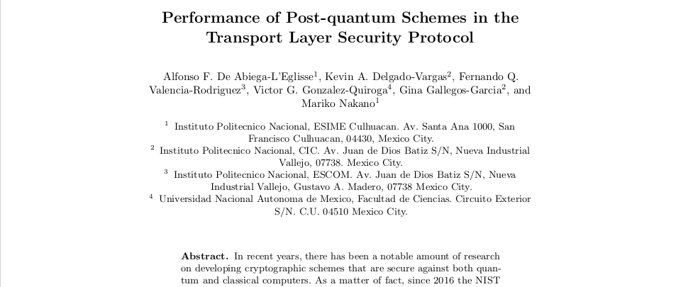
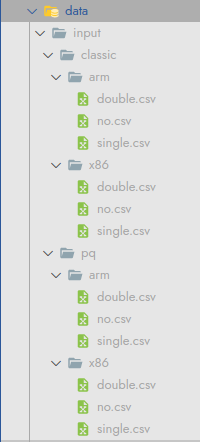

# Reproducible research for the "Performance for the Post-quantum Schemes in the Transport Layer Security Protocol" article



This repository allows a fellow scientist to reproduce research for the comparison of post-quantum vs classical TLS protocols, with an experimental design that takes architecture and signature schemes into account.

The repository file is loosely based on the [cookiecutter data science template](https://drivendata.github.io/cookiecutter-data-science/#directory-structure) adapted to R.

## Requirements

To reproduce this research you need:
- [R language](https://cloud.r-project.org/)
- [GNU Make](https://www.gnu.org/software/make/)
- PQTLS experimental data (see the sample layout in `data/sample/input`)

## Setup

Clone this repository and go to the resulting directory:
```
git clone https://github.com/masterquiroga/tls1.q
cd tls1.q
```

Install the dependencies with make:
```
make dependencies
```

## Reproduce the research

Run your individual experiments and save them in `data/input`. 

The experimental data must be CSVs with 4 columns, each measuring clock times for each of the different TLS protocol stages:
- The first one `auth` is the time it takes to perform the TLS authentication process. 
- The second one `exchange` is execution clock cycles taken for the key exchange in TLS. 
- The third one `cypher` is for the clock cycles that were obtained for the encryption performed in the TLS. 
- The last one `total` indicates the total clock cycles that were obtained when the complete execution of the TLS protocol took place.
See more in the section 3.2 Experimental Design of the article.

Finally according to the architecture used and signature scheme, your file layout must comply to the following:


Then you can prepare your dataset from individual experiments:
```
make data
```

Make your exploratory data analysis:
```
make eda
```

And finally reproduce the research models:
```
make models
```
Your outputs will be in the `data/output` directory.

## Acknowledgments

That's all! We hope this helps you make your research easier, and in turn helps us all make better science!

## Credits
See the [AUTHORS](./AUTHORS) file.
